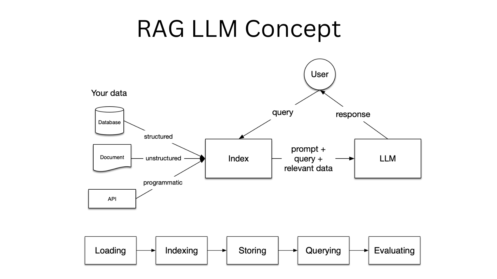

# RAG Based LLM Chatbot for NVIDIA Videos


This project is designed to extract and summarize information from NVIDIA videos using Streamlit, an open-source app framework, alongside a custom retrieval-augmented generation model (RAG) built on top of OpenAI's GPT-3.5 Turbo. The code initializes a web application with Streamlit, loads a corpus of documents from a specified directory, indexes them, and then allows the user to ask questions about specific NVIDIA videos. When a question is asked, it retrieves relevant information from the corpus, generates a concise summary, and displays it on the web application.

---

## Issues With GPT4 + Bing (and Other LLM)

Currently the premium extension of ChatGPT (GPT4 + Bing Search extension) has issues with retrieving information on video content from YouTube or other similar platforms.


While some of the videos, have corresponding documentation or news - less obscure ones cannot be accessed / or provide an accurate summary.

To save time to the user from wasting unecessary time, we have built a chat interface which automatically provides summary for available youtube videos (in this case from the NVIDIA channel).

---

## High Level Solution Overview and Description

In order to solve this issue, we will try to extract the transcript and text from all videos related to NVIDIA channels and then collide the files to a single text document for faster access to the LLM.

Then we will utilize LlamaIndex for a RAG based LLM with access to the retrieved files. After some preprocessing and testing, we review the answers and if they correspond to the extracted text.

After we are satisfied with the solution, we rewrite the code and extend streamlit as the front end chat interface for the user.

Finally, we deploy the application for wide use, while keeping in mind things we can change for different use cases or scaling the application.

---

## Deep Dive in Architecture


Initially we compile a list of all channels related to NVIDIA and its products, which totals to more than 3,230 videos. Then we use the channel Ids to gather all the video Ids, for which we can continue and get the details for each video and the corresponding transcript. 

*Note: Less then half of the videos didnt contain transcript due to lack of speech/narrative - while some didn't allow the download of the transcription due to privacy rights*

For reviewing the process of obtaining the full text output through the scripts:

- `Get_Video_Id_Sample.py`
- `Extract_Transcription_Details_Sample.py`

The next step would be to create an indexed vector store for the created data and use an LLM to access the data within out context

---

## LLAMA Index & RAG 



# Architecture Description

## Overview

The code provided outlines a Streamlit application designed to extract and summarize information from NVIDIA videos. The application leverages a retrieval-augmented generation model (RAG) built on top of OpenAI's GPT-3.5 Turbo to process user queries and generate concise summaries of the relevant videos. The architecture encapsulates various components including data loading, indexing, a chat engine, and a user-friendly interface to facilitate interactions.

## Key Components

### 1. **Streamlit Framework**:
Streamlit is utilized to create an interactive web application. It renders the UI, captures user inputs, and displays the generated responses.

```python
import streamlit as st
```

### 2. **Custom Libraries**:
A set of custom libraries encapsulated in the `llama_index` module is used to handle data indexing and interaction with OpenAI's models.

```python
from llama_index import VectorStoreIndex, ServiceContext, Document
from llama_index.llms import OpenAI
from llama_index import SimpleDirectoryReader
```

### 3. **OpenAI Configuration**:
The OpenAI API is configured using an API key, which is extracted from Streamlit's secrets management system.

```python
import openai
openai.api_key = st.secrets.openai_key
```

### 4. **UI Initialization**:
The UI is initialized with a header, a background image, and a pre-defined message to guide the user on how to interact with the application.

```python
st.header("Extract Information From NVIDIA Videos")
...
```

### 5. **Data Loading and Indexing**:
A custom function `load_data` is defined to load and index documents from a specified directory. The indexed data is stored in a `VectorStoreIndex` instance which facilitates efficient retrieval of relevant documents based on user queries.

```python
@st.cache_resource(show_spinner=False)
def load_data():
    ...
```

### 6. **Chat Engine**:
A chat engine is initialized using the indexed data. It operates in a "condense_question" mode to generate concise responses to user queries.

```python
chat_engine = index.as_chat_engine(chat_mode="condense_question", verbose=False)
```

### 7. **User Interaction**:
User input is captured through a chat input box. The application maintains a session state to store the chat history. Upon receiving a new query, the chat engine processes the query, generates a response, and updates the chat UI accordingly.

```python
if prompt := st.chat_input("Your question"):
    ...
```

## Workflow

1. The user launches the Streamlit application.
2. The `load_data` function asynchronously loads and indexes the document data.
3. The user enters a query related to a specific NVIDIA video in the chat input box.
4. The chat engine processes the query, retrieves relevant documents, and generates a concise summary.
5. The generated response is displayed in the chat UI, and the user can enter a new query to continue the interaction.

For deployment we use the prebuilt Streamlit community cloud for ease of access. However, for production we would need to take into account additional considerations.

---

## Other Considerations

### Vector Database Considerations for Our Product

To improve the speed of our app its important to consider a vectordb for the specific use case.


The landscape of vector databases in 2023 is broad, with each offering unique features catering to varied needs.

### Key Considerations

#### 1. **Open-Source and Cloud Hosted Solutions**:
   - For proponents of open-source solutions, Weviate, Milvus, and Chroma stand out.
   - Pinecone, while not open-source, excels in developer experience and offers a robust fully hosted solution.

#### 2. **Performance Metrics**:
   - Milvus leads in queries per second (QPS), followed by Weviate and Qdrant.
   - Pinecone and Milvus deliver impressive sub-2ms latencies, which can be crucial for real-time applications.

#### 3. **Community Support**:
   - A strong community often translates to better support and quicker resolution of issues.
   - Milvus, Weviate, and Elasticsearch have substantial community backing, indicative of their robustness and ongoing enhancements.

### 4. **Scalability, Advanced Features, and Security**:
   - Role-Based Access Control (RBAC) is essential for enterprise applications, available in Pinecone, Milvus, and Elasticsearch.
   - Dynamic segment placement offered by Milvus and Chroma is beneficial for evolving datasets.

#### 5. **Cost Efficiency**:
   - Budget-friendly options like Qdrant are viable for startups or small-scale projects.
   - For larger, high-performance necessitating projects, Pinecone and Milvus provide competitive pricing tiers.

---


### LLM (Large Language Models) Considerations for Our Product

### Key Considerations

#### 1. **Privacy Concerns**:
   - Llama2b, when fine-tuned, offers enhanced privacy features, making it a suitable choice for applications demanding data confidentiality.

#### 2. **Accuracy and Performance**:
   - GPT-4 stands out in terms of performance, enabling faster responses and handling a higher volume of requests efficiently.
   - The accuracy of responses is crucial for user satisfaction and task effectiveness, where fine-tuned models like Llama2b might excel.

#### 3. **Community Support**:
   - A strong community backing is indicative of the model's robustness, ongoing enhancements, and the availability of support.
   - By referring to community forums and platforms like Hugging Face, we can gauge the level of community support and activity around these models.

#### 4. **Customizability and Fine-tuning Capabilities**:
   - The ability to fine-tune LLMs on domain-specific data is essential for achieving high accuracy and relevance in responses.
   - Models like Llama2b offer fine-tuning capabilities, allowing for better customization to our specific use case.

#### 5. **Infrastructure and Cost Efficiency**:
   - The infrastructure requirements and the associated costs for running these LLMs at scale should be assessed.
   - Comparing the computational efficiency and resource demands between models like GPT-4 and Llama2b is crucial for long-term sustainability.

#### 6. **Integration and Compatibility**:
   - Ease of integration with existing systems and compatibility with other technologies is essential for a smooth deployment.

### Other Considerations


### Front End

- React / Svelte etc.
- ChatUI
- Gradio
- Chainlit
- Langchain

### Deployment

- Serverless Architecture (API Gateway, Lambda, SageMaker/EC2, S3)
- Containerized Solution (Docker, ECR, Fargate ECS, VPC, S3)
- Other Equivalents (GCP, Azure, Digital Ocean)

---


## References

### Tutorials and Blog Posts

- **[Building a Fullstack LLM Langchain Chatbot on AWS](https://community.aws/tutorials/fullstack-llm-langchain-chatbot-on-aws)**
  - A comprehensive tutorial on setting up a full-stack chatbot using Langchain on AWS infrastructure.

- **[Crafting Chatbot with Local LLM using Langchain](https://www.mlexpert.io/prompt-engineering/chatbot-with-local-llm-using-langchain)**
  - An article discussing the implementation of a local LLM chatbot using Langchain.

- **[Build a Chatbot Running Purely On Your Local Machine using LLaMa 2 & Epsilla Langchain](https://blog.epsilla.com/build-a-chatbot-that-runs-purely-on-your-local-machine-using-llama-2-epsilla-langchain-a5053b16f85)**
  - A blog post detailing the steps to build a local chatbot using LLaMa 2 and Epsilla Langchain.

- **[Crafting an AI-Powered Chatbot for Finance using RAG, Langchain and Streamlit](https://medium.com/predict/crafting-an-ai-powered-chatbot-for-finance-using-rag-langchain-and-streamlit-4384a8076960)**
  - An insightful post on developing a financial chatbot utilizing RAG, Langchain, and Streamlit.

- **[How to Build a Chatbot That Knows Your Company's Information](https://www.reddit.com/r/LocalLLaMA/comments/17hs77a/how_to_build_chatbot_that_knows_your_companys/)**
  - A Reddit thread discussing the construction of a company-centric chatbot.

- **[Local Retrieval QA Use Case Documentation](https://python.langchain.com/docs/use_cases/question_answering/local_retrieval_qa)**
  - Official documentation on implementing local retrieval Q&A using Langchain.

### Video Tutorials and Playlists

- **[Video Tutorial: Implementing LLM Chatbots](https://www.youtube.com/watch?v=x5SYNpfK4H0)**
  - A video tutorial explaining the process of implementing LLM-based chatbots.

- **[Video Tutorial: Advanced LLM Chatbot Features](https://www.youtube.com/watch?v=o1BCq1KJULM)**
  - A video explaining advanced features and functionalities of LLM chatbots.

- **[Video Tutorial: Local Retrieval QA with Langchain](https://www.youtube.com/watch?v=J8TgKxomS2g&t=290s)**
  - A tutorial video on implementing local retrieval question answering systems using Langchain.

- **[LLM Chatbot Development Playlist](https://youtube.com/playlist?list=PLVEEucA9MYhMkc4HvgHw-TvycgoMhADOI&si=hyd64IhalJnv8XJv)**
  - A playlist containing a series of video tutorials on LLM chatbot development.
